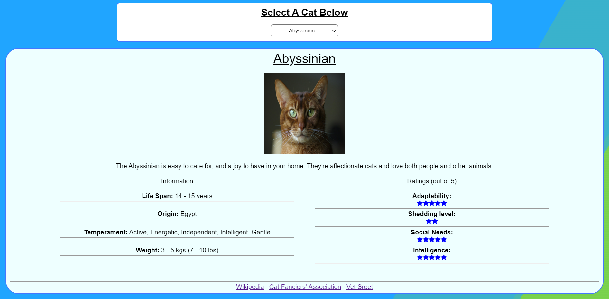

<h1>Cat App</h1>

This project was built with create-react-app. To run the app simply clone the repo and run ```npm install``` in the directory and then ```npm run start```.

It was built as a take home project for a company  with instructions to retrieve data from <a href=" https://thecatapi.com/" target="_blank">a cat API </a> and render it to the page using any framework/language I wanted. I chose React beacuse its the one I enjoy using the most and the one I have the most experience in.


